# Architecture

How the AI talks universe is put together, and why it is put together that
way. The prose that explains each piece to a *user* is in `README.md`; this
file is the map — what talks to what, what is derived from what, and the
decisions that hold it in that shape. Current numbers are in `STATE.md`, open
work in `TODO.md`, and the story of how each piece got here in `HISTORY.md`.

Every diagram is Mermaid, which GitHub renders inline.

## The system in one picture

Five sources, four stages, one corpus, three readers.

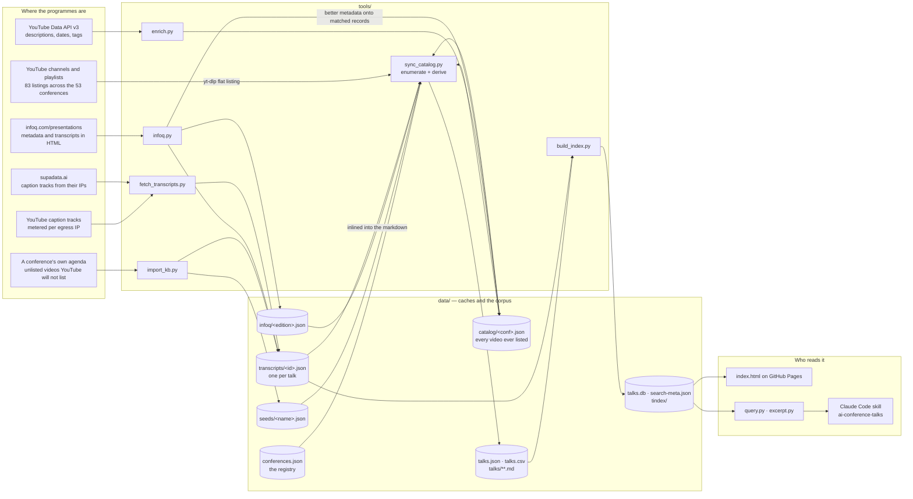

Two properties of this picture carry everything else:

* **Every stage caches to disk and is resumable, and the corpus is re-derived
  offline.** `sync_catalog.py` without `--refresh` and `build_index.py` touch
  no network and produce byte-identical output from the caches. That is what
  makes enumeration cheap to redo weekly while transcripts accumulate over
  months, and what makes the year floor, the AI filter and every other
  derive-time rule reversible without a fetch.
* **The expensive column is the transcript**, and it is the only column with
  four suppliers. Everything about `fetch_transcripts.py` — routes, the
  egress pool, the four failure classes — exists to spend the cheapest one
  that returns exact timings.

## The pipeline, stage by stage

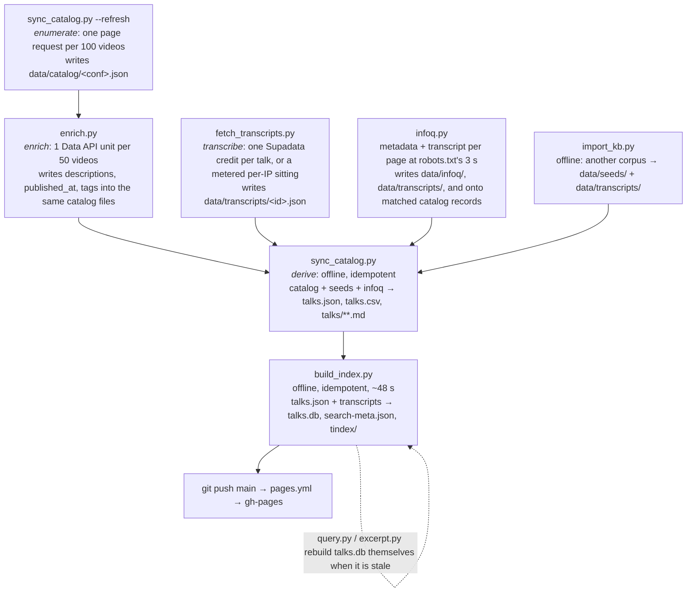

The order matters in one place: **enrich before derive** for any conference
registered `"scope": "ai"`, because the AI filter reads the description, and a
talk whose title never says "AI" is dropped before it is ever enriched unless
`enrich.py --all` ran first. And **always chain `sync_catalog.py` and
`build_index.py` onto a fetch**: a transcript that is on disk but not indexed
is invisible to every reader, so it is a credit spent for nothing.

## What is derived from what

Solid arrows are generation. Everything below the registry line is
reproducible from what is above it, and the two right-hand columns are
reproducible from `talks.json` plus `transcripts/` alone.

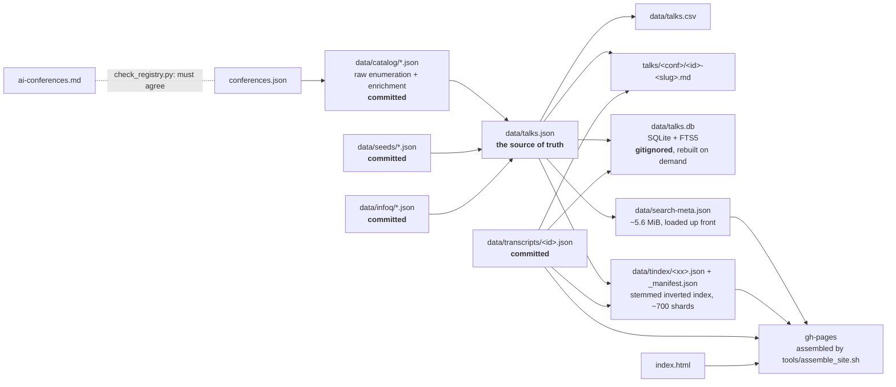

Why four representations of the same corpus:

| Artifact | For | Why not the others |
|---|---|---|
| `talks.json` / `.csv` | scripts, spreadsheets | exact, complete, no prose to parse |
| `talks/**.md` | humans, `grep`, an agent reading one talk | git-diffable per talk; one file is the whole talk |
| `talks.db` | ranked CLI search | derived; delete any time |
| `search-meta.json` + `tindex/` | the browser | GitHub Pages has no backend, so the index must exist as files |

### One talk record

`talks.json` carries one record per talk; the keys the search layers weight
most are the ones a channel is least likely to fill in.

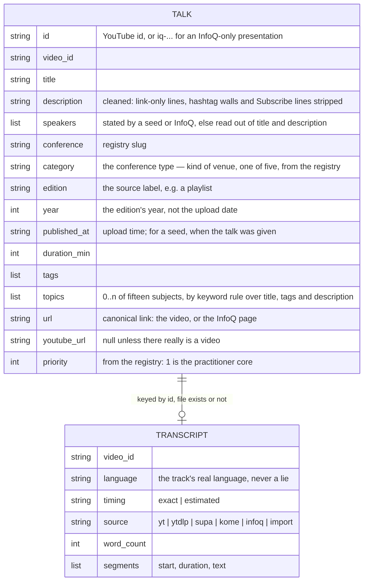

## Deriving the corpus: what survives

`keep_video()` in `sync_catalog.py` runs once per enumerated video. A source
may override any rule its conference sets, which is how a curated seed
contributes a whole congress while the same conference's channel listing
contributes only its AI talks.

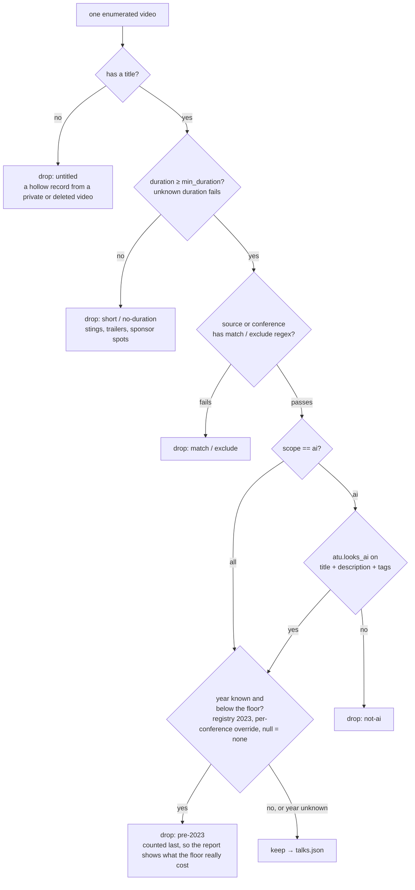

An unknown year *passes* the floor while an unknown duration *fails* the
minimum, and both are deliberate: enrichment is what resolves a year, so
dropping the undated would hide every talk a fresh enumeration found until the
next enrich run; a listing route always returns a duration, so a record
without one is degraded.

Two guards sit after the filter: a source that returns nothing keeps its cached
videos (yt-dlp exits 0 with no entries when throttled), and the run refuses to
write a corpus more than 10% smaller than the last one without
`--allow-shrink`. Both count records; `refresh_report.py` is the field-level
guard, and it lives in CI rather than here.

### Who gave the talk

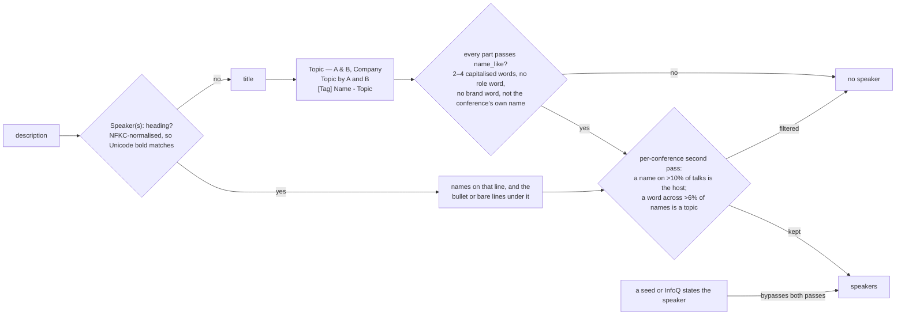

The rule is conservative on purpose: `speakers` is weighted four times a
description word in both rankers, so one false positive lands under every talk
that carries it.

### What a talk is about

`category` is a fact about the conference — every talk inherits one of five
registry labels, which name the kind of venue (*Practitioner AI
conferences*, *General software conferences*, *Security conferences*,
*Vendor events*, *Business & industry events*) and are presented in the
browser as **Conference type** — so it cannot follow a subject inside a
programme. `topics` is per talk and multi-valued: fifteen subjects (`atu.TOPICS`), each a list of
phrases compiled with the same word boundaries as the AI-relevance test.

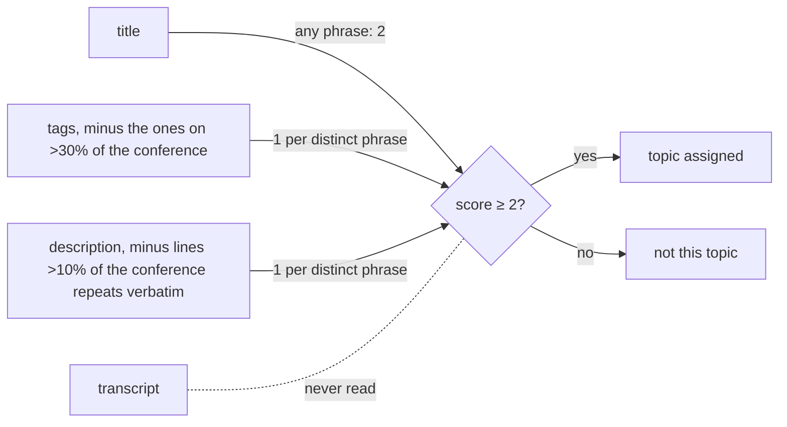

A title mention is enough by itself; tags and description together have to
say two *different* things about a subject. Transcripts are left out on
purpose — a third of talks have one, and a label that moved when a transcript
arrived would make the facet drift with every fetch. The two subtractions are
the speaker rule again: what a whole conference repeats is the channel, not
the talk (PyData's "PyData is an educational program of NumFOCUS…" under every
video, AI Engineer's `startups` tag on every upload). A subject the conference
really is about survives them, since an abstract says it in its own words.
Topics are a facet, not a search field: they are in neither FTS table and in
no ranker, so the two rankers' agreement is untouched by them.

## Fetching transcripts

### The route ladder

`fetch_one()` walks the routes cheapest first and exact before estimated. A
block on our IP is remembered rather than swallowed: the off-IP routes still
get their turn, and if none is configured the block is re-raised so the caller
can bench the identity. What must never happen is a block quietly becoming an
estimate.

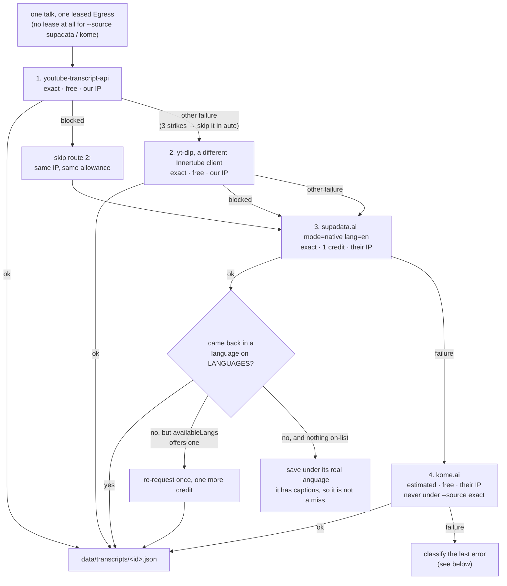

### Four kinds of failure, one of which is a fact about the video

`_misses.json` is permanent — `select()` skips anything in it forever unless
`--retry-misses` — so what may be written there is the whole question. The
runners ask one predicate, `about_the_video()`, before writing a miss, which is
what makes a *new* failure class retryable by default instead of silently
permanent.

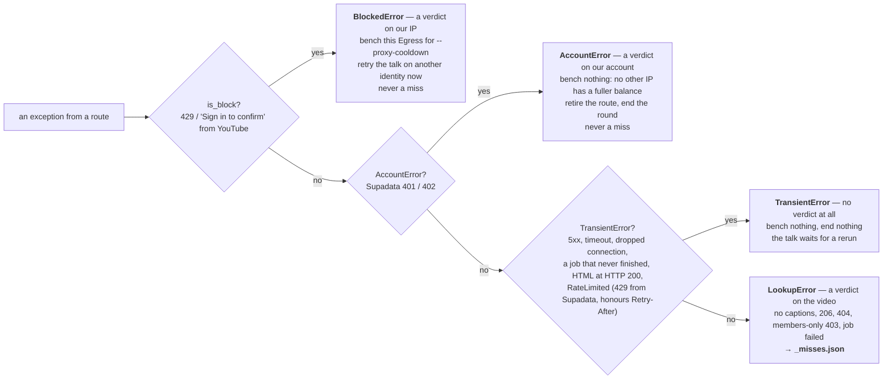

A 429 from Supadata is *not* an IP block — benching an identity would not
help, since the request went out from their IP — and it is not an account
refusal either, since waiting fixes a rate limit and does not fix an empty
balance. It gets its own class, backs off, retries, and is the one thing that
makes `--workers 32` safe.

### The egress pool

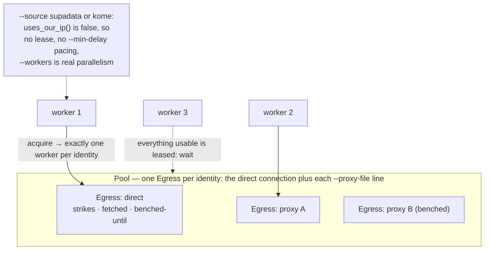

The lease is about spending an IP's allowance, not about politeness: two
parallel requests down one IP spend that IP's allowance twice as fast for no
extra throughput. A route that egresses from somebody else's IP therefore takes
no lease and no pacing, which is the difference between ~3 talks a minute and
~250. Measured, and the reason `spent()` has to know about it too, or an idle
pool would read as "still has options" and a round would never end.

### What a run selects

`select()` re-derives its work from disk every time: every talk with a YouTube
id, within `--conference` / `--priority` / `--year` / `--min-year`, whose
transcript file does not exist and which is not in `_misses.json`. Sorted by
priority, then longest first. There is no list to keep, so an interrupted run
is resumed by repeating the command, and a block costs only time.

## Searching

Two rankers, one corpus, and they agree by construction where it matters:
both tokenise on Porter stems (`atu.stem()` in Python, its twin in
`index.html`, `test_stem.py` proving they agree on every word in the corpus),
both weight `speakers` at 4× a description word, and both give a passage that
says the query's words *together* the same saturating bonus.

### The CLI — `query.py`

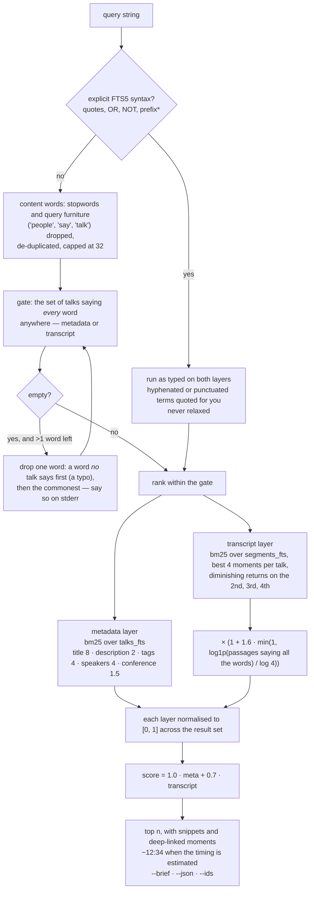

Normalising before blending was a correctness fix, not tuning: `bm25()` is
only comparable within one table, and a 24-word passage scores near its
maximum on almost any match, so blended raw every query returned the same few
long workshops that happened to have transcripts.

Since *Search enrichment* (2026-09-02) the front of that diagram has more
shapes. A bare word whose stem belongs to a group in `atu.SYNONYMS` becomes
one gate term that is the OR of its group, said on stderr as relaxation is; a
`-word` subtracts the talks saying it from the gate before ranking; column
filters (`title:agents`, `speakers:"harrison chase"`, `{title tags}:rag`,
`transcript:kubernetes`) go to FTS5 as written, every prefix but `transcript:`
stripped on the passage layer. Filters — conference, category, year and
`--max-year`, `--since`/`--before` with `year` as the fallback for undated
talks, `--speaker`, duration, `--exact-timing` — bound the gate; `--sort`
reorders a wider candidate set above a score floor; `--per-conference K` and
`--per-year K` are a window over the ranked set; `--facets` counts the gate.
Re-uploads of one title collapse into the first with `(also: …)`.

When `data/embeddings/` is present and current, a bare query also goes to the
optional semantic layer (`semantic.py`, below): the lexical head —
`max(3 × n, 50)` — and the vector top-k over the same filtered pool are
fused by reciprocal rank, a vector-only hit rendered as "(semantic match)"
with no snippet. `--no-semantic` turns it off; when the layer is absent
nothing changes and nothing is printed unless `--explain` asks.

### The browser — `index.html`

No backend, so the index is files and the page fetches only what a query
needs.

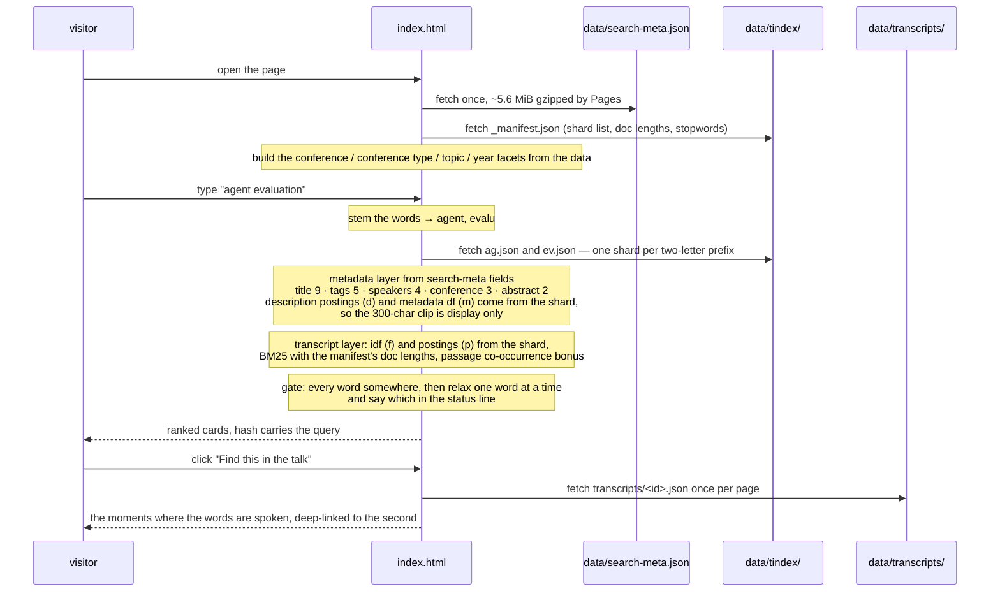

The shard key is the term's first two characters and `shard_key()` in
`build_index.py` must agree exactly with `shardKeyOf()` in `index.html`: a
disagreement is silent — the browser asks for a shard the manifest does not
list, gets nothing, and transcript search quietly degrades to metadata-only
hits. Two characters is the deepest split that still keeps "agent" and
"agentic" in one shard for free, since both tokenisers drop terms shorter than
two characters.

The browser's query language mirrors the CLI's where the data allows: `title:`
`speaker:` `conf:` `year:` `transcript:` are read by `parseQuery()` before the
tokeniser (so the colon never reaches `surface()`, and `year:`/`conf:` set the
selects), `-word` excludes, a quoted phrase gates, `prefix*` bypasses the
length gate, `OR` groups and the manifest's synonym groups gate as
every-group-has-a-member with only the typed word highlighted. Duration sorts,
a length bucket, a speaker datalist and a "spoken only" toggle are all in the
hash; facet counts are computed over the other dimensions and change labels
only. There is **no semantic layer in the browser** — a query would have to be
embedded client-side — which is why `suite-ranking` runs `query.py
--no-semantic`.

### The index files

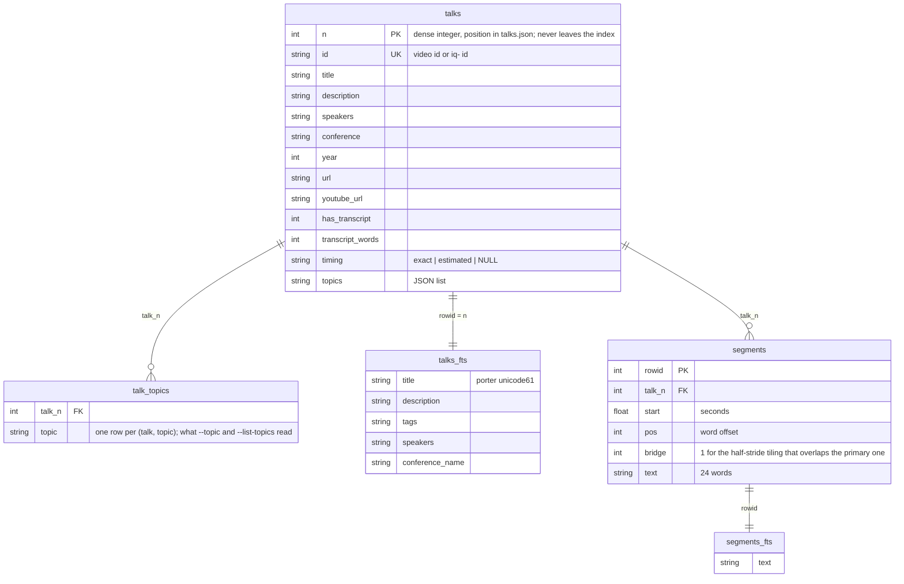

Passages are 24 words at a 12-word stride, so a phrase that straddles a
boundary lands whole in the bridge passage. `PRAGMA user_version` carries
`atu.DB_SCHEMA_VERSION`; `atu.connect()` rebuilds the database when that
differs or when `talks.json` or `transcripts/` is newer, saying so on stderr,
which is why the file can be gitignored.

A `tindex/` shard entry, per stem:

| key | holds | used for |
|---|---|---|
| `f` | idf over transcripts | transcript BM25 |
| `p` | `[talk n, tf, base-36 delta-coded passage positions]` | transcript BM25, and "Find this in the talk" without fetching the transcript |
| `d` | `[talk n, tf]` over the *whole* description | the metadata layer beyond the 300-character clip |
| `m` | how many talks say the stem anywhere in their metadata | the metadata layer's idf |

A stem said once in one transcript and in no description is left out; a stem
in even one description is kept, since it was findable through the clip and
must stay so. Talks whose transcript is an ASR failure (under 10 words a minute
over 5+ minutes) are indexed with no text and a zero word count, so the badge,
the filter and the moments link all agree; the file stays on disk so the
fetcher does not buy the same bytes again.

`_manifest.json` also carries `synonyms`, the groups of `atu.SYNONYMS`, so
the browser expands exactly what the CLI expands; and a `search-meta.json`
record carries `lg` only when the fetcher read the transcript as something
other than English — ~300 bytes over the corpus, rendered as "transcript
language", since the dozen `hi` ones are English mis-detected.

### The optional semantic layer — `semantic.py`

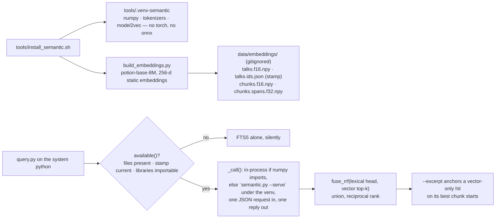

The stamp in `talks.ids.json` records `talks.json`'s `generated_at` and size,
the transcript count, `DB_SCHEMA_VERSION`, the model and `LAYER_VERSION`; any
mismatch makes the layer step aside rather than return row numbers that no
longer mean the same talks. It is never rebuilt by `db_stale()`.

### Reading a talk without reading all of it — `excerpt.py`

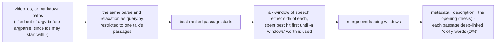

`-n` is a budget, not a count: counting passages bounds nothing, because on a
talk that says the word every other minute six windows grow into each other
and hand back the whole transcript under the name of an excerpt. Measured over
eight topics and 45 talks: 100% of the passages `query.py` ranked survive into
the excerpt, on 17% of the words.

Beside the windows there are three cheaper views, each with a measured price:
`--quotes` prints only the sentence holding a query word, timestamped and
linked (~30 tokens a quote); `--outline` prints two-minute buckets with their
tf-idf terms and the query's density (~17 tokens a bucket), which tells a
model where to aim a second `-q`; `--at SECONDS` anchors a window with no
query at all, the companion a semantic hit needs. `--words`/`--total-words`
budget in the unit the model reasons in. `query.py --excerpt` runs all of it
in the same process as the ranking.

### The skill — a retrieval ladder with a price on it

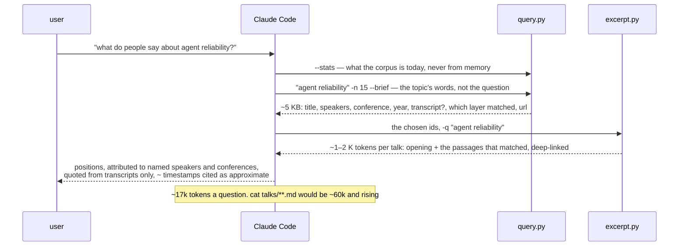

Two rungs were added on 2026-09-02: `--facets` before choosing a slice,
because the transcripts are 99% year-2026 and a top-100 shows it, and
`--per-conference K` in place of a five-call loop. `--excerpt` folds the
second and third rungs into one call when the ids are not going to be chosen
by hand.

## Publishing and automation

### Every push to `main` publishes

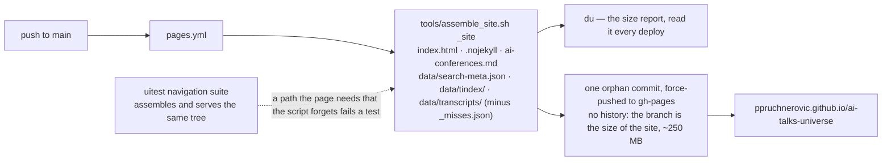

The mirror it replaced was the whole repository: 411 MB of a 1 GB ceiling,
169 MB of it never fetched by any browser, and on a curve to ~850 MB at full
transcript coverage.

### The weekly refresh proposes, it does not write

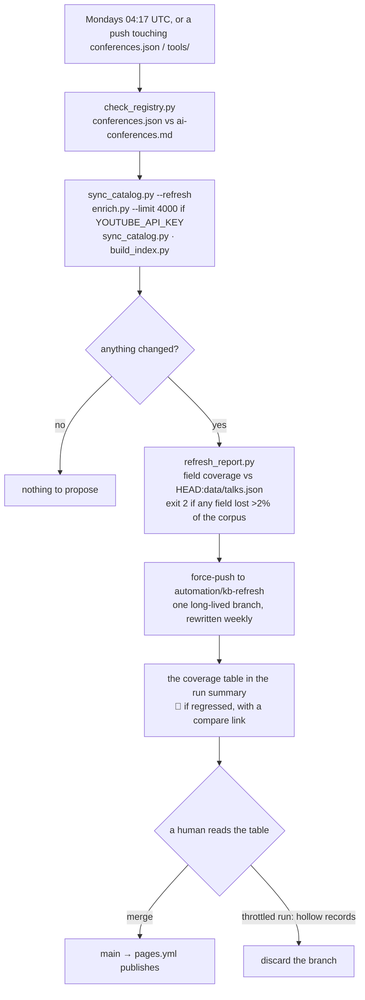

Transcripts are deliberately not fetched here: YouTube blocks GitHub's IP
ranges outright, and the one route that would work from CI, Supadata, would
spend credits on a schedule. The review gate exists because enumeration from a
runner *degrades* rather than fails — a throttled listing returns titles and
durations with no uploader, and one scheduled run wrote `channel: null` over
~4,540 talks; the record-count backstops both passed it. So the report diffs
field coverage, which is the thing a reviewer needs and cannot get from a
4,600-file diff of generated JSON.

## Testing — what each suite exists to catch

Every failure these guard is quiet and expensive, which is the criterion for
having written a test at all.

| Suite | Runs in | Protects against |
|---|---|---|
| `test_fetch_transcripts.py` (128) | ~1 s, faked HTTP and egresses | a block recorded as a miss; an estimate returned under `--source exact`; a talk dropped when its proxy was benched; the lease rule; both 429 paths |
| `test_excerpt.py` (14) | 0.1 s, pure functions | the excerpt that is the whole transcript |
| `test_query.py` (34) | 0.1 s, a throwaway database | OR chains with hyphens; ids that cut short at a hyphen; `--topic` resolving one word of a label, and refusing an ambiguous one |
| `test_speakers.py` (19) | 0.1 s | every speaker shape, and the brand or job title that would rank under every talk carrying it |
| `test_topics.py` | 0.1 s, no corpus | a topic firing on a title it is not about; the boundaries that are rules (a bare "enterprise", a bare tool name, "prompt injection"); a phrase pattern that can match nothing; a conference's boilerplate filing the whole conference under one subject |
| `test_infoq.py` | offline | the fold-in, the two-way dedupe, the re-keyed transcripts |
| `test_stem.py` | ~6 s, reads the corpus, runs node | the Python and JavaScript stemmers disagreeing on any corpus word — a silent miss on one side |
| `check_registry.py` | instant | `conferences.json` and `ai-conferences.md` drifting apart |
| `refresh_report.py` | CI | a hollowed field passing the record-count guards |
| `tools/uitest/` (193 checks, 9 suites, ~4 min) | Playwright + Chromium against a local server, or `KB_URL=` against production | the browser: load, search, controls, filters, moments, resilience, a11y, ranking agreement with the CLI, navigation and the assembled site |

The browser suites skip rather than fail when a fixture has not been collected
yet, so a green run reads its skip count: the last full run skipped nothing.

## Design decisions worth not relitigating

- **Two files describe the conferences, on purpose.** `ai-conferences.md` is the
  human curation — why a source is worth having, what is gated, what was
  rejected and why. `conferences.json` is what the tools read.
  `check_registry.py` compares them per conference block, not per URL, because a
  block usually lists both a channel and the playlists on it and the registry
  deliberately takes only one of the two.

- **The AI filter is a property of the source, then of the conference — never
  of the corpus.** A dedicated AI conference contributes everything
  (`scope: "all"`); a general one contributes only what matches `atu.AI_RE`
  (`scope: "ai"`); and a single source may override its conference, which is
  how the WeAreDevelopers World Congress seed contributes all 358 sessions
  while the same conference's channel listing still contributes only its AI
  talks. The distinction that matters is not the topic but the provenance: a
  curated agenda is a programme, a channel listing is uploads. The regex allows a
  trailing hyphen but not a leading one, so "AI-native" and "ML-powered" match
  while "chai-latte" and "html-first" do not. That asymmetry is load-bearing;
  the first version rejected "The AI-native SDLC".

- **Enumeration is flat, and details are a separate stage.** A flat listing is
  one request per 100 videos; a full extraction is ~1.4s *each* and draws on the
  same IP reputation the transcript fetch needs. Fusing them would make a weekly
  refresh a multi-hour crawl.

- **A source that returns nothing keeps its cached videos.** `yt-dlp` exits 0
  with no entries when it is throttled — a successful-looking run that would
  otherwise delete a conference. There is a second backstop:
  `sync_catalog.py` refuses to write a corpus more than 10% smaller than the
  last one without `--allow-shrink`.

- **Topics are derived, per talk, from title, tags and description — and from
  nothing else.** The category facet is per conference and cannot follow a
  subject inside a programme, so the topic facet exists; it is keyword rules
  because that is what the AI-relevance filter already is and what a person
  can read and correct. Transcripts are excluded so the label does not move
  when a transcript arrives. A tag scores like a description phrase, not like
  a title: measured over the corpus, scoring tags like titles labelled 178
  more talks and about half of those were a track's tag ("Copilot and agents
  at work") rather than the talk's subject. And what a conference repeats —
  a description line under more than a tenth of its talks, a tag on more
  than three tenths — is stripped before scoring; the first rule tried,
  ignoring any *phrase* said by half a conference, also removed Black Hat's
  "security" and the MCP summit's "mcp", which are the conferences' subjects.
  Topics enter no ranker and no FTS table, so adding them changed nothing
  about which talk answers a query, only which talks a filter admits.

- **The category is a venue, not a subject, and enters no ranker.** Its five
  labels were renamed on 2026-09-02 to say so — *AI security* became
  *Security conferences*, *AI engineering & agents* became *Practitioner AI
  conferences* — because once the topic facet shipped, the old names read as
  a second, coarser subject list beside *Security, safety & red teaming* and
  *Agents & orchestration*. The facet itself is not redundant: 577 of the
  1,314 security-topic talks are from security conferences, 276 from general
  software conferences, 219 from vendor events, and the security conferences
  hold 122 talks on agents; the two facets cross, and questions like
  "security-conference speakers on agents" need both. The browser's
  metadata layer had scored the label at weight 2 and counted its words
  toward the every-word-somewhere gate, so "security" matched every talk at
  ten security conferences whether or not the talk was about security. The
  CLI's `talks_fts` never held the column. The browser stopped scoring it on
  2026-09-02 and `build_index.py` stopped counting it in the metadata
  document frequency, so the two rankers now score the same fields. The
  field, the CSV column, the `g` key and the `--category` flag keep their
  names; only the labels and the page's wording changed, and `#f-cat` and
  its hash parameter are untouched so shared links resolve.

- **Talks are keyed by YouTube video id, but the indexes use a dense integer.**
  Repeating an 11-character id in every posting would roughly treble the browser
  index, and FTS5 needs an integer rowid anyway. `build_index.py` assigns `n`
  from the position in `talks.json` (which `sync_catalog.py` sorts
  deterministically). `n` never leaves the index it was built for; everything
  that outlives a build — transcripts, markdown — is keyed by video id, and both
  index halves are always rebuilt together. `index.html` reads `data-n` for
  ranking and `t.v` for the transcript URL.

- **Speaker extraction is two-pass, and the second pass is what makes the first
  safe.** No per-title rule can tell "Lian Li" from "Rare Disease Applications"
  — both are capitalised words in a delimiter-separated title. What tells them
  apart is the rest of the conference: a *name* appearing in more than a tenth
  of its talks is the host or the brand, and a *word* appearing across more than
  6% of a conference's candidate names is a topic label, because real names do
  not share vocabulary. Both filters are applied per conference. Coverage was
  32% from titles alone and 37% once the descriptions arrived, since many
  channels write "Speaker: …" in the description.

- **A seed is a source, not a hand-edit of the catalogue.** Videos could have
  been written straight into `data/catalog/<conf>.json`, and would even have
  survived a refresh, since deletion is per source URL. They would not have
  survived a reader: nothing in the registry would say where 358 videos came
  from, and a fresh clone could not re-derive them. `"type": "videos"` puts the
  provenance where every other source's provenance is, and costs one merge path
  that both kinds of source share.

- **Stated speakers bypass the two-pass name filter.** The filter exists because
  a title is all most of this corpus has, and it works by assuming a name seen
  across a tenth of a conference is a brand. An agenda that names its speakers
  outright breaks that assumption in the right direction — a real speaker with
  many sessions is prolific, not a brand — so seeded names skip both passes.
  Speaker coverage went from 2,591 to 2,947 on 357 talks, because every one of
  them has a name the heuristics would mostly have missed.

- **The transcript index is sharded two characters deep, and `shard_key()` in
  `build_index.py` must agree exactly with `shardKeyOf()` in `index.html`.**
  There is no shard-*count* knob: the key is the term's prefix, so the depth is
  the count. One character meant every term starting with "s" shared a 4.0 MB
  file that was downloaded whole to answer one query; two gives 674 shards, a
  1.7 MB worst case and a 1.2 KB median, for the same 38.4 MB total — this buys
  query cost, not repo size. The constraint that sets the depth is that terms
  sharing a prefix must share a shard, because the browser resolves "agent" ->
  "agentic" by scanning the keys of the one shard it fetched. Two is the
  deepest split that keeps that for free, since both tokenizers drop terms
  shorter than two characters and the shortest possible query term is
  therefore exactly a whole key. Going deeper needs the browser to fetch every
  shard matching a short prefix, which is a real change rather than a constant.
  A disagreement between the two functions is **silent**: the browser asks for
  a shard the manifest does not list, gets nothing, and transcript search
  quietly degrades to metadata-only hits.

- **The egress lease is about spending an IP's allowance, not about being
  polite.** So a route that egresses from somebody else's IP takes no lease and
  no pacing delay (`uses_our_ip()`), and a route that uses ours still takes
  exactly one at a time. The temptation on reading `Pool` is to conclude that
  serialising is the safe default and leave it alone; it is not safe, it is 80×
  slower, and the guarantee it exists to provide does not apply to Supadata at
  all. The three checks that pin this down — nothing leased, workers actually
  overlapping, and `spent()` ending the round on an idle pool — are in
  `test_fetch_transcripts.py` and need no network.

- **A 429 is not the same kind of refusal as a 402.** Both are account-level,
  which is why they were handled together, and that was wrong once more than
  one request was in flight: waiting fixes a rate limit and does not fix an
  empty balance. 429 backs off and retries, then raises `BlockedError` — never
  `LookupError`, because that path writes `_misses.json` and a miss means *this
  video has no captions* forever. 401 and 402 still retire the route for the
  run, and now raise `AccountError` for the same reason 429 raises
  `BlockedError` — see below.

- **Four kinds of failure, and only one of them is a fact about the video.**
  `_misses.json` is permanent, so what may be written there is the whole
  question. A `LookupError` is a verdict on the talk (no captions, 206, 404, a
  job that came back failed); `BlockedError` is a verdict on our IP, which
  benches that identity and retries the talk elsewhere; `AccountError` is a
  verdict on our account, which benches nothing — no other IP has a fuller
  balance — retires the route and ends the round; `TransientError` is no
  verdict at all, so it benches nothing and ends nothing, and the talk simply
  waits for a rerun. `about_the_video()` is the one predicate the two runners
  ask before writing a miss, which is what makes a new failure class retryable
  by default instead of silently permanent — the previous arrangement asked
  `is_block()`, so everything that was not an IP block was cached forever.

- **Collection is scoped to 2026, the corpus to 2023, and enumeration to
  nothing.** Three lines for three costs, and collapsing them is the mistake.
  `enrich.py` and `fetch_transcripts.py` both take `--year` / `--min-year` /
  `--include-unknown-year`, and the standing intent is `--min-year 2026`: an
  allowance that refills over hours should not be spent on talks that have gone
  stale. That one filters *selection only*. The corpus line is the registry's
  `"min_year": 2023`, applied once at derive time and overridable per conference
  — see *The pre-2023 cut* in `HISTORY.md`; `query.py --year` still reads every year the corpus
  has. Enumeration has no line at all: `data/catalog/` caches all 17,677 videos
  whatever the other two say, because listing is free and it is what makes both
  of them reversible without a fetch. On enrichment, add `--include-unknown-year`:
  enrichment is what resolves a year, so without it the talks that have none can
  never become known 2026 talks. There were 3,082 of them; the run that carried
  the flag left 2. `year_of()` moved to `atu.py` when the
  second and third tool needed it.

- **Enrichment takes conferences whole, in priority order.** Every run is a
  partial run, so what a blocked run leaves behind is a design choice. Taking a
  slice of each conference would leave forty conferences 6% enriched and none of
  them answerable; taking them whole means "what was said at AI Engineer" works
  completely while the rest wait. The first run predated this and spent all 369
  of its budget on `ai-engineer` purely because that was registry order —
  `enrich.py` now sorts by `priority` first.

- **`query.py` normalises each layer before blending them, and this was a
  correctness fix, not a tuning preference.** `bm25()` is only comparable within
  one table. A passage is a ~25-word document, so almost any match in one scores
  near the maximum — a raw passage score (~8) lands on top of the best possible
  title score (~9) and then accumulates over four moments. Blended raw, *every*
  query returned the same handful of long workshops, the talks that happen to
  have been transcribed, however well another talk's title answered it: the CLI
  top hit for "kubernetes" was a workshop that mentions it in passing. The
  WeAreDevelopers corpus hid this because all 358 talks had transcripts. Now
  each layer is normalised to [0,1] across the result set and blended
  `1.0 × meta + 0.7 × transcript`, so a talk's own metadata leads and what was
  said on stage is strong corroborating evidence rather than an override.
  Transcript-only hits still surface — `query.py postgres` still finds the talk
  that only says it out loud, at rank 14 (it was rank 4 when this was written;
  the rank drifted with the corpus, the property did not).

- **A bare query is ANDed, then relaxed; explicit FTS5 syntax never is.** ANDing
  every token is right for a keyword query and returns nothing at all for a
  natural-language question, which is how an agent actually asks. So a bare
  multi-word query falls back to an OR of its content words *only when the AND
  matches nothing*, and says so on stderr — ranking still puts the talks matching
  every term, together, on top. Anything the user typed as FTS5 (`"phrase"`,
  `OR`, `NOT`, `prefix*`) is passed through verbatim and never relaxed, because
  guessing at explicit syntax is how a search silently stops meaning what it says.

- **Query terms are de-duplicated and capped, and this was a complexity fix.**
  A pasted blob scaled super-linearly — `agent` x400 took 169 seconds. Bare
  queries de-duplicate case-insensitively and cap at 32 terms with a warning;
  explicit syntax is de-duplicated only in a flat chain joined by a single
  idempotent operator, never across parentheses, `NEAR`, `NOT` or mixed
  operators. Same query now runs in 0.19s, and the worst case anywhere is 1.5s.

- **The two rankers are compared at the web's top 40, not its top 10.** They
  disagree about ordering by design: `talks.db` tokenises with Porter stemming,
  the browser matches token prefixes, and their field weights differ. On a
  corpus this size "kubernetes" has dozens of near-identical title matches, so
  which ten come first is a coin toss between two good answers. Measured over
  the suite's eight queries, the CLI's top 10 lands in the web's top 10 between
  0 and 9 times, and in its top 40 between 4 and 10 times. The check asserts 4
  at 40. Both rankings were inspected by hand at the time and both are good.
  That range no longer holds: at 6,979 talks it is 0 to 10 and three of the
  eight queries fail, because a common term now has hundreds of good title
  matches and 40 is too narrow a window to catch any of them. The rankings are
  still both good — what needs rethinking is the check.

- **`data/talks.db` is gitignored.** It is derived, rebuilds in seconds, and
  would otherwise push megabytes of churning binary into every commit.
  `search-meta.json` and `tindex/` *are* committed — GitHub Pages can only serve
  files that exist in the repo.

- **Descriptions are clipped to 300 characters in `search-meta.json`**
  (`build_index.py: META_DESC_CHARS`) and only there. The full text stays in
  `talks.json`, the markdown and `talks.db`. Every visitor downloads that file
  before typing anything, and YouTube descriptions run long and repetitive — the
  same channel boilerplate under 400 talks. `sync_catalog.clean_description`
  already strips link-only lines, hashtag walls and "Subscribe" lines, which
  would otherwise be indexed as if the speaker had said them.
  The extrapolation held: at 5,816 talks the file was 1.6 MB with no
  descriptions and 2.0 MB with 369 of them, and enrichment took it to 7.3 MB at
  6,979 talks with 5,138 — past the line that was set as the trigger, so
  the clip halved and it came back to 5.4 MiB. Seven new conferences then took
  it to **7.76 MiB (8,135,293 bytes), 129% of the trigger**, and the documented
  remedy was applied again: `META_DESC_CHARS` 600 -> 300, back to **5.79 MiB
  (6,068,517 bytes)**, 96% at 9,325 talks with 7,313 descriptions. That is the
  second halving, so a third crossing is better met by moving descriptions out
  of the up-front download than by clipping them to 150 characters.
  **The trigger's unit is binary and now says so in code**:
  `META_SIZE_TRIGGER_BYTES = 6 * 1024 * 1024` = 6,291,456 bytes. This mattered —
  the file is *under* 6 MiB but *over* 6 MB decimal, so the ambiguity alone
  decided whether the clip needed halving. **`atu.human_size()` was fixed to
  match on 2026-09-01**: it always divided by 1024 while labelling "MB", so
  every size this repo ever printed looked decimal and was not. It now says
  `MiB`, and `atu.decimal_size()` exists for comparing against a vendor figure.
  The divisor did not change, so no recorded number moved — only the labels, and
  historical "MB" figures in this file are all MiB. `build_index.py` reports
  where the file stands after each run.
  GitHub Pages gzips; the local test server does not, which is why
  `suite-navigation` allows 8 seconds for a cold load.

- **Hiding a control needs more than `hidden`.** `index.html` hides `#more`,
  `.abs-more` and `#f-tr` by setting the `hidden` property, but any author rule
  that sets `display` on one of them outranks the UA stylesheet's `[hidden]` —
  so the element stays on screen while the script believes it is gone. This
  shipped in the corpus this was ported from: a four-hit search offered "Show
  more (-16 left)". A `[hidden] { display: none !important; }` reset covers all
  three and `suite-controls` guards it. Do not remove the reset.

- **Ranking matches tokens, never substrings.** Two bugs were found by testing
  in the original and must not be reintroduced: without IDF weighting a generic
  term outranks a rare one, and with raw substring matching "rust" matches every
  talk containing "t*rust*". Here the trap word is **"rag"**, which sits inside
  "program", "storage" and "fragment" — `suite-search` asserts it is never
  highlighted inside them. `showMoments()` and `highlight()` are the two places
  that historically slipped back to substrings; both go through `tokenize()` and
  `\b`-anchored matching.

- **Synonym groups live in one table and reach both rankers from it.**
  `atu.SYNONYMS` is expanded by `query.py` at parse time and written by
  `build_index.py` into `tindex/_manifest.json` for `index.html`; membership is
  by stem, each group is one gate term, explicit FTS5 syntax is never
  expanded. Adding a group anywhere else, or one ranker only, breaks the
  agreement `suite-ranking` asserts — which is exactly how a `k8s`-only
  expansion in the CLI had "kubernetes" agreeing at 3 of 10 for a while.

- **The semantic layer is opt-in, silent on absence, and fused, not
  reranked.** It is built by `tools/install_semantic.sh` and by nothing else —
  never by `db_stale()`, never on first query — so a clone that has not run it
  is unchanged. When present it contributes a ranking that is fused with the
  lexical *head* by reciprocal rank: fusing the whole lexical list let deep
  hits the vectors liked outrank exact-title hits (1 of 10 in the lexical top
  40 for "agent evaluation"; head-k gives 5). Union, because the failure being
  fixed is recall and a reranker cannot add a talk.

- **The ranking-agreement suite compares lexical to lexical.** The browser has
  no semantic layer, so `suite-ranking` passes `--no-semantic`. If the browser
  ever gets one, the suite gains a second comparison rather than losing the
  flag.
