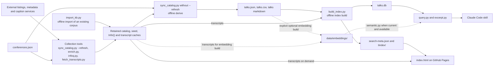
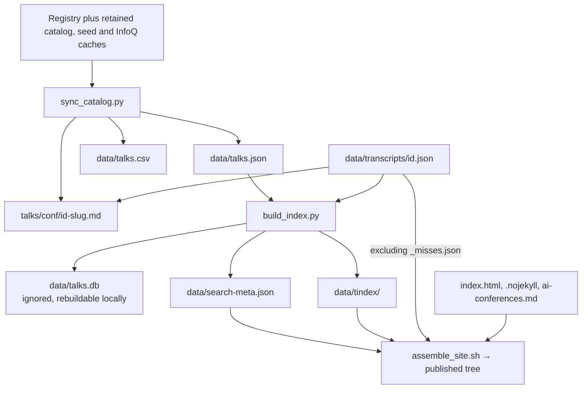

# Architecture: boundaries, flows and ownership

## What

The current system map for changes spanning pipeline stages or readers.
The app collects conference listings and transcripts into a static corpus,
then serves it through a browser, terminal tools, and a Claude Code skill.
There is no application server or browser-side collection pipeline.

This spec owns the system boundary diagrams and the directory of contracts
between domains. Domain specs own detailed behavior, formats, algorithms,
and verification; their detailed definitions take precedence over summaries
here. Read only the relevant domain after using this map to find it.
[Design rationale](../docs/ARCHITECTURE.md) preserves the experiments and
tradeoffs behind this structure; it is not an additional rule source.

## Where

### System boundaries

Collection performs network work and retains results. Derive and index-build
are offline consumers of those results. Optional embedding installation may
fetch dependencies and a model; it is outside the offline rebuild path.
Publication assembles files for a static host, not a service that runs Python.

### Artifact flow

The registry describes sources; it cannot recreate acquired bytes by itself.
`talks.json` supplies the derived records; transcript presence and text live
in separate files. The precise commit/ignore policy belongs to
[publishing.md — What is committed, generated, or ignored](publishing.md#what-is-committed-generated-or-ignored):
caches and generated corpus/browser files are tracked; local databases,
vectors and assembled output are ignored.

| Boundary / artifacts | Writer and consumer | Detailed owner |
|---|---|---|
| Registry and talk records | `tools/atu.py` shares loaders and derivation helpers across tools | [data-model.md](data-model.md) |
| Catalog, seed and InfoQ caches → corpus | Collection/import tools → `tools/sync_catalog.py` | [catalog-sync.md](catalog-sync.md) |
| Transcript caches → indexed speech and citations | `tools/fetch_transcripts.py`, `tools/infoq.py`, `tools/import_kb.py` → builder and readers | [transcripts.md](transcripts.md) |
| Corpus → SQLite → terminal output | `tools/build_index.py` → `tools/query.py`, `tools/excerpt.py` | [search-cli.md](search-cli.md) |
| Corpus → static indexes → browser | `tools/build_index.py` → `index.html` | [search-browser.md](search-browser.md) |
| Corpus → optional vectors → query fusion | `tools/build_embeddings.py` → `tools/semantic.py` → `tools/query.py` | [semantic.md](semantic.md) |
| CLI output → answers and citations | `tools/query.py`, `tools/excerpt.py` → `.claude/skills/ai-conference-talks/SKILL.md` | [skill.md](skill.md) |
| Generated files → published site | `tools/assemble_site.sh`, `.github/workflows/pages.yml`; refresh proposals from `tools/refresh_local.sh` | [publishing.md](publishing.md) |

## How

### Cross-domain contract directory

These are change-routing links, not duplicate definitions of the contracts.
Update each contract in its owning spec and follow its verification guidance.

| If a change affects… | Consult the canonical definition and affected consumer |
|---|---|
| Offline derivation, cache retention or stage ordering | [catalog-sync.md — How](catalog-sync.md#how); index-build determinism in [search-browser.md — How](search-browser.md#how) |
| Talk identity, ordering or transcript lookup | [data-model.md — The talk record](data-model.md#the-talk-record); vector row alignment in [semantic.md — How](semantic.md#how) |
| Timings, language or failure persistence | [transcripts.md](transcripts.md); citation consumers in [skill.md](skill.md) and [search-cli.md](search-cli.md) |
| Python/JavaScript stemmers, shard keys or manifest fields | [search-browser.md — How](search-browser.md#how); this owns the `shard_key()` / `shardKeyOf()` agreement |
| Shared synonyms and lexical ranking behavior | [search-cli.md — How](search-cli.md#how), with browser implementation mapped by [search-browser.md](search-browser.md) |
| SQLite schema or staleness | [search-cli.md](search-cli.md); optional-layer stamp behavior in [semantic.md](semantic.md) |
| Optional embedding availability and fusion | [semantic.md — How](semantic.md#how) |
| CLI flags, output strings or citation fields | [skill.md — Couplings: what in SKILL.md must change when a tool changes](skill.md#couplings-what-in-skillmd-must-change-when-a-tool-changes) |
| Browser fetch paths, published files or refresh gates | [publishing.md](publishing.md), including its publish and local-refresh diagrams |

### Maintaining the map

Change this file when a system boundary, major flow, artifact owner or
cross-domain dependency changes. Keep local algorithm diagrams in their
domain specs and link them from the explanatory docs. Keep each diagram in
one file; prose may explain its rationale without becoming another authority.

Spec-maintenance hooks should follow the same ownership: update the affected
domain and this map only if its boundary changed. No repository-local hook is
required to read every architecture diagram for an unrelated task.

Run `python3 tools/check_specs.py` after map edits and check relative links
and diagram syntax. That guard verifies mapped paths and tool coverage; it
does not prove diagrams match runtime behavior. Follow
[publishing.md — Verifying a change](publishing.md#verifying-a-change--ordered)
for the checks appropriate to an implementation change. Documentation-only
routing changes do not require regenerating the corpus or indexes.
