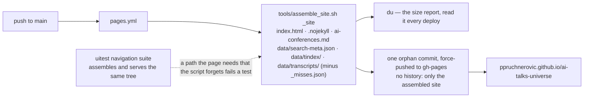
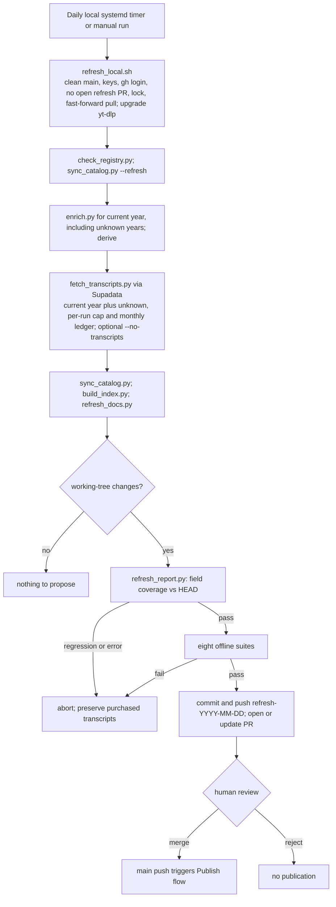

# Publishing, automation, repo hygiene and the docs set

## What

This domain is everything that happens *after* the corpus and indexes exist:
how a push becomes a live site, how the weekly bot proposes new talks without
being allowed to write, what is and is not committed, how a change is verified
before it lands, and which document holds which fact.

Responsible for:

- `pages.yml` — every push to `main` assembles the site and force-pushes it to
  `gh-pages` as one orphan commit. Publishes only what `index.html` fetches.
- `tools/refresh_local.sh` — the refresh, run daily on the maintainer's
  machine by a systemd user timer (`tools/systemd/`, installed by
  `tools/install_refresh_timer.sh`), because both keys live there and CI has
  neither. Chain: preconditions (clean tree, on `main`, keys present, `gh`
  authenticated, no open PR from an earlier `refresh-*` branch, flock)
  → `git pull --ff-only` → `pip install -U yt-dlp` in `tools/.venv` (best
  effort, `--no-update` skips it; the venv's binary is put first on `PATH`)
  → `check_registry.py` → `sync_catalog.py --refresh`
  → `enrich.py --min-year <this year> --include-unknown-year` →
  `sync_catalog.py` → `fetch_transcripts.py --source supadata --min-year
  <this year> --include-unknown-year --workers 32 --limit 300` (the credit
  cap; `--limit N`, `--no-transcripts`; the limit is first lowered to what
  is left of `SUPADATA_MONTHLY_BUDGET`, default 3,000 per calendar month,
  `--monthly-budget N` overrides, and at zero the fetch is skipped; the
  fetcher's `done: N fetched, M missed` line is added to
  `~/.config/ai-talks-universe/credits-YYYY-MM.log` as `date N+M`)
  → `sync_catalog.py` → `build_index.py` → `refresh_docs.py` (rewrites the
  corpus counts in `README.md`, `docs/GUIDE.md` and `docs/STATE.md`)
  → `refresh_report.py -o logs/…` (rc 2 aborts) → the eight offline suites →
  commit on `refresh-YYYY-MM-DD`, push, `gh pr create` with the report as
  body. **Never** commits to `main`; merging the PR is the gate and triggers
  `pages.yml`. On abort it restores tracked files and deletes untracked ones
  *except* `data/transcripts/`, so bought transcripts survive and the next
  run folds them in; the dirty-tree check ignores untracked transcripts for
  the same reason. Keys come from `~/.config/ai-talks-universe/env` (mode
  600), never the shell profile; `GH_TOKEN` lives there too because a timer
  inherits no `gh` login. An open `refresh-*` PR blocks the next run because
  its transcripts exist only on that branch: merge or close it first, or the
  same videos are bought again. `install_refresh_timer.sh` enables
  `loginctl` lingering so the timer fires without a login session. Logs to `logs/refresh-<date>.log`.
  `--dry-run` prints the plan. The former `kb-refresh.yml` (a weekly Actions
  run that could enumerate but never enrich or fetch) was removed on
  2026-09-11; its design notes are in "The refresh branch" below.
- `tests.yml` — every push to `main` and every pull request: `ruff check .`
  (Pyflakes only, configured in `pyproject.toml`), `check_registry.py`, then
  the eight offline suites in one chain. No network, no `talks.db`; the
  browser suites are not run here. This is the badge at the top of `README.md`.
- The open-source set at the root: `LICENSE` (MIT, code), `DATA-NOTICE.md`
  (CC BY 4.0 for the curated data, no claim over transcripts, takedown
  route), `CONTRIBUTING.md` (the verification order below, distilled),
  `CODE_OF_CONDUCT.md`, `SECURITY.md`, `CHANGELOG.md` (dated, Keep a
  Changelog; user-visible changes only, `docs/HISTORY.md` keeps the detail),
  `AGENTS.md` and `CLAUDE.md` (both point at `specs/README.md`),
  `.github/ISSUE_TEMPLATE/`, `.github/PULL_REQUEST_TEMPLATE.md`,
  `.github/dependabot.yml`. When the verification order changes, change
  `CONTRIBUTING.md` and the PR template in the same commit as this spec.
- `refresh_report.py` — the gate that table comes from: per-field coverage of
  the working-tree corpus vs `HEAD:data/talks.json`.
- `assemble_site.sh` — the one definition of "the site". Used by `pages.yml`
  and by the uitest `navigation` suite, so a missed path fails a test.
- `.gitignore` — derived artefacts stay out of git *and therefore* off Pages.
- The verification checklist and the division of labour across the six docs.

Not responsible for: what the pipeline stages compute (`catalog-sync.md`,
`transcripts.md`), what the indexes contain (`search-browser.md`,
`search-cli.md`), or the uitest suites' internals (`search-browser.md`).

Live site: <https://ppruchnerovic.github.io/ai-talks-universe/>, served from
`gh-pages`. Remote: `github.com/ppruchnerovic/ai-talks-universe`.

## Where

### Workflows and scripts

| Path | What it is |
|---|---|
| `.github/workflows/pages.yml` | `on: push` to `main` + `workflow_dispatch`. Two steps: `tools/assemble_site.sh _site`, then `git init -b gh-pages` inside `_site`, one commit `Publish <sha8>`, `git push --force` to `gh-pages`. `permissions: contents: write`; `concurrency: pages`, cancel-in-progress. Only env: `GITHUB_TOKEN` (built-in). |
| `.github/workflows/kb-refresh.yml` (removed 2026-09-11, kept here for the record) | Python 3.12, `pip install yt-dlp`, then in `tools/`: `check_registry.py` → `sync_catalog.py --refresh` → (only if `YOUTUBE_API_KEY` secret is set) `enrich.py --limit 4000` + `sync_catalog.py` → `build_index.py`. If `git status --porcelain` is non-empty: `refresh_report.py -o /tmp/refresh-report.md` (rc 0 clean / 2 regressed / else fail), then `git checkout -B automation/kb-refresh`, commit "Refresh the AI talk catalogue", `push --force`, and append the report + a `compare/main...automation/kb-refresh` link to `$GITHUB_STEP_SUMMARY`. `concurrency: kb-refresh`, no cancel. Transcripts are never fetched here (YouTube blocks GitHub's IP ranges). |
| `tools/assemble_site.sh OUT_DIR` | `rm -rf OUT`; copy `index.html`, `.nojekyll`, `ai-conferences.md` (footer link) to `OUT/`; `data/search-meta.json`, `data/tindex/`, `data/transcripts/` to `OUT/data/`; delete `OUT/data/transcripts/_misses.json`; print `du -sh` per part and total. `set -euo pipefail`; resolves the repo root from its own location, so it runs from anywhere. |
| `tools/refresh_docs.py` | Rewrites the corpus counts the docs quote, from `atu.connect()` + `query.stats()`, `atu.load_talks()` (InfoQ-only = no `youtube_url`) and the `count` of every `data/catalog/*.json`. Owns: the headline in `README.md` and `docs/GUIDE.md`, the "Of N videos enumerated … the corpus is T" and "N of the T talks are 2026, of which W have a transcript" sentences in `docs/GUIDE.md`, and the "N talks / T transcripts / C conferences / E enumerated" line in `docs/STATE.md`. Each pattern must match exactly once or it exits 2 (reword the sentence, update the pattern). `--check` exits 1 when a number is stale and writes nothing. The `docs/STATE.md` state table is prose with history and is not touched. |
| `tools/refresh_report.py` | `FIELDS = (channel, description, year, speakers, tags, published_at, topics)`, `TOLERANCE = 0.02`. `committed_talks(ref)` reads `git show <ref>:data/talks.json`; `report(base, now, tol)` returns markdown + regressed flag: talks before→after, added/dropped ids, a per-field Before/After/Δ table, "Do not merge as-is" when any field lost more than `int(len(base)*tol)` talks, first 40 added and dropped titles. Flags `--base` (default `HEAD`), `--tolerance`, `-o/--out`. Exit 0 clean, 1 no baseline, 2 regressed. Uses `atu.ROOT` and `atu.load_talks()`. |
| `tools/check_registry.py` | `conferences.json` vs `ai-conferences.md`, per conference block. First step of the refresh and of the local checklist. See `catalog-sync.md`. |
| `tools/requirements.txt` | Two packages, both only for the fetcher/enumerator: `youtube-transcript-api>=1.0`, `yt-dlp>=2025.1.1`. Everything else (`sync_catalog`, `enrich`, `build_index`, `query`, `excerpt`, `refresh_report`) is standard library. |
| `tools/requirements-semantic.txt` | Pinned, wheels-only deps for the optional layer; installed by `tools/install_semantic.sh` into `tools/.venv-semantic/`. See `semantic.md`. |
| `tools/uitest/package.json` | `playwright ^1.56`; `postinstall` runs `playwright install chromium`. `node run.js` serves the checkout on a free port (or uses `KB_URL=` and starts no server, `run.js:64`); `suite-navigation.js:24` runs `assemble_site.sh` into a temp dir and serves *that*. See `search-browser.md`. |
| `.nojekyll` | Empty file, copied into the site so Pages serves `_`-prefixed paths (48 transcript ids start with `_`) without Jekyll processing. |

### What is committed, generated, or ignored

| Path | Status | Notes |
|---|---|---|
| `conferences.json`, `ai-conferences.md`, `index.html`, `*.md`, `.claude/skills/` | committed, hand-edited | source |
| `data/catalog/*.json` (53), `data/seeds/wearedevelopers-wwc26.json`, `data/infoq/*.json` (15) | committed | enumeration caches and seeds; rewritten by `sync_catalog.py --refresh` / `infoq.py` |
| `data/transcripts/<id>.json` (3,175 files incl. `_misses.json`) | committed | fetched on a real machine, never in CI; `_misses.json` is bookkeeping and is stripped from the site |
| `data/talks.json`, `data/talks.csv`, `talks/<conf>/<id>-<slug>.md` (9,048) | committed, **generated** by `sync_catalog.py` | byte-identical on rerun; `generated_at` moves only when the corpus does |
| `data/search-meta.json`, `data/tindex/` (712 files) | committed, **generated** by `build_index.py` | byte-identical on rerun |
| `data/talks.db` | **ignored** | FTS5 index, ~380 MiB, 48 s; `atu.connect()` rebuilds it when stale |
| `data/embeddings/`, `tools/.venv-semantic/` | **ignored** | optional semantic layer, derived |
| `_site/` | **ignored** | what `assemble_site.sh` builds; the published tree |
| `tools/.venv/`, `tools/uitest/node_modules/`, `tools/__pycache__/`, `logs/` | **ignored** | local tooling and scratch |

Published (on `gh-pages`, ~250 MB): `index.html`, `.nojekyll`,
`ai-conferences.md`, `data/search-meta.json`, `data/tindex/`,
`data/transcripts/` minus `_misses.json`. **Not** published: `talks/`
markdown (114 MB), `data/catalog/`, `talks.json`, `talks.csv`, the docs,
`tools/`, `conferences.json`. The ignore rules matter for publishing because
before 2026-09-02 the whole checkout *was* the site; that is why the comments
in `.gitignore` cite Pages.

### The docs set

| File | Holds | Do not put here |
|---|---|---|
| `README.md` | the landing page: the headline numbers, the browse link, a terminal quick start, the docs index, licence |
| `docs/GUIDE.md` | user prose: what the corpus is, how to search (browser, CLI, skill, semantic, excerpt), how to rebuild, what gets published, how to test | session narrative, open items |
| `specs/README.md` | brief orientation and task routing | detailed diagrams or rationale |
| `specs/ARCHITECTURE.md` | system boundary and artifact-flow diagrams, ownership and cross-domain contract directory | local algorithms, historical measurements, duplicate contract definitions |
| Domain specs | detailed behavior, local diagrams, files, invariants and verification; authoritative for their domain | copies of another spec’s diagrams or contracts |
| `docs/ARCHITECTURE.md` | explanation, tradeoffs, historical measurements and links to canonical spec diagrams | implementation rules; define them in the owning spec and link there |
| `docs/STATE.md` | the state table ("Where things stand"), "Verifying a change", the transcript-run handoff, the quota, "Numbers to refresh" | history; meant to stay short |
| `docs/TODO.md` | open work, one list, each line pointing at a `docs/HISTORY.md` section; finished lines are **deleted**, not struck | background |
| `docs/HISTORY.md` | dated write-ups per session, verbatim — provenance for every number and decision | anything that needs to be current |
| `ai-conferences.md` | the human curation twin of `conferences.json` (why a source, what is gated, what was rejected); `check_registry.py` enforces the pairing | — |

**Numbers to refresh when the corpus changes** (`docs/STATE.md` §"Numbers to
refresh"). These must move together:

| Where | Which numbers | Source of truth |
|---|---|---|
| `README.md` and `docs/GUIDE.md` | talks / transcripts / conferences / enumerated; the 2026 scope count and how many are transcribed | `refresh_docs.py` writes them (from `query.py --stats` and the catalog caches) |
| `docs/STATE.md` "Numbers to refresh" line | talks / transcripts / conferences / enumerated | `refresh_docs.py` |
| `docs/STATE.md` state table | transcript, description, year, tag, speaker coverage; per-conference transcript split; 2026 pending backlog; passage count; credits spent this month; sizes of `talks.db`, `search-meta.json`, `tindex/`; test and uitest check counts | `sync_catalog.py` end-of-run coverage; `build_index.py` passage count, sizes and the 6 MiB trigger line; the suites' own tallies |
| `.claude/skills/ai-conference-talks/SKILL.md` | none — deliberately carries no hard-coded counts | — |

### Git conventions (from `git log --oneline -25`)

- Subject lines are full sentences in the imperative, no type prefix, no
  trailing period, often 60–100 chars: *"Publish only what the browser fetches,
  not the whole repository"*. Doc-only commits prefix the file: *"docs/STATE.md: …"*.
- One branch per piece of work (`topic-facet`, `conference-type`,
  `infoq-presentations`, `fix-kb-refresh-gate`, …), merged into `main` with an
  explicit merge commit — *"Merge topic-facet"* or a descriptive *"Merge the
  InfoQ route and the 2026-09-02 review"*. Local branches are left in place
  after merging. Long-running branches get `main` merged in (*"Merge main into
  search-options: …"*) rather than rebased.
- Worktrees live under `.claude/worktrees/` (directory exists, currently
  empty); the remote branch `worktree-search-options` is one such. Agent
  worktrees are named after the branch.
- Bot branches: `refresh-YYYY-MM-DD` (one per daily run of
  `refresh_local.sh`, deleted after merge), `gh-pages` (one orphan commit,
  rewritten on every deploy). Never base work on either.

## How

### Local setup

```bash
python3 -m venv tools/.venv && source tools/.venv/bin/activate   # Python 3.12 (CI pins it)
pip install -r tools/requirements.txt        # yt-dlp must also be on PATH for sync_catalog.py
cd tools/uitest && npm install               # Playwright + Chromium, for run.js and test_stem.py's node half
tools/install_semantic.sh [--chunks]         # optional; see semantic.md
```

`SUPADATA_API_KEY` and `YOUTUBE_API_KEY` live in `~/.bash_profile`; a
non-login (tool-driven) shell does not read it, and the tools degrade
*silently* to free routes without them. `source ~/.bash_profile` explicitly.
`refresh_local.sh` reads them (and `GH_TOKEN`, `SUPADATA_MONTHLY_BUDGET`)
from `~/.config/ai-talks-universe/env` instead; `install_refresh_timer.sh`
creates that file empty.

### Verifying a change — ordered

1. `cd tools && python3 check_registry.py` — instant; fails if
   `conferences.json` and `ai-conferences.md` drift.
   `python3 tools/check_specs.py` — instant; fails if the spec map names a
   path that is gone, or a script in `tools/` that no spec names.
2. Offline suites, in one chain so a failure stops the run:
   `python3 test_query.py && python3 test_excerpt.py && python3 test_infoq.py && python3 test_speakers.py && python3 test_topics.py && python3 test_semantic.py && python3 test_stem.py && python3 test_fetch_transcripts.py`
   (all ~0.1–1 s except `test_stem.py` ~6 s, which reads the corpus and runs
   node; `test_semantic.py` skips its end-to-end block when the layer is absent).
   `docs/STATE.md`'s block omits `test_semantic.py`; `docs/GUIDE.md` includes it. Run it.
3. If the corpus or the index changed, prove idempotence: run
   `python3 sync_catalog.py && python3 build_index.py` **twice** and confirm
   `git status --porcelain` is empty after the second run. Both must be
   byte-identical run to run (`build_index.py` iterates shard terms sorted for
   exactly this reason; a set-ordered build broke it silently once).
4. The first `query.py`/`excerpt.py` call after a corpus change rebuilds
   `talks.db` (~48 s, says so on stderr). That is `atu.db_stale()` working, not
   a fault; do not "fix" it.
5. `cd tools/uitest && node run.js` — nine suites, ~4 min. Read the **skip
   count** as well as failures: fixtures the corpus lacks skip rather than fail,
   so a green run with skips is weak evidence. The current check count is the
   one in `docs/STATE.md`'s state table; trust `run.js`'s own tally over any prose.
   `ranking` skips its CLI half without
   `talks.db`. `navigation` runs `assemble_site.sh` itself, so a path the page
   needs that the script forgets fails here.
6. After a deploy: `KB_URL=https://ppruchnerovic.github.io/ai-talks-universe/ node run.js load moments`
   against production, and read the `du` lines in the `pages.yml` log — the
   only size report there is, since `build_index.py`'s 6 MiB trigger watches
   `search-meta.json`, not the site. Pages ceiling is 1 GB; site is ~250 MB and
   grows ~62 KB per transcript.
7. If you changed what `index.html` fetches, change `assemble_site.sh` in the
   same commit. Nothing else publishes it.

### The refresh branch

History of the gate; the mechanism now lives in `tools/refresh_local.sh`
(see "What"), which keeps the same rule: a regression in the coverage table
aborts, and only a human merge publishes.

- The gate is a human reading the coverage table in the run summary, then
  opening a PR from the compare link if it is worth merging. Merging to `main`
  triggers `pages.yml`, which is the only publish path.
- Why no direct commit and no bot PR: on 2026-08-31 a throttled enumeration
  returned the right *number* of videos with `channel: null` and overwrote
  ~4,540 records; both record-count backstops (empty source keeps cache; 10 %
  shrink refused without `--allow-shrink`) passed it, and the old workflow
  committed and published it. `GITHUB_TOKEN` is also refused for
  `createPullRequest`, and that refusal came after the push, so every gated run
  ended red with the table discarded. Hence: push branch, write summary, stop.
- A red (regressed) summary means hollow records, not new information. Discard
  the branch; do not merge and "fix later".
- To reproduce the table locally after any rebuild: `cd tools && python3 refresh_report.py`
  (exit 2 = a field lost >2 % of the corpus). It needs a committed
  `data/talks.json` to diff against — a shallow clone with `fetch-depth: 1` is
  enough, but a tree without `HEAD` is not.

### Repo hygiene

- Never commit `talks.db`, `_site/`, `data/embeddings/` or a venv; every one
  of them would otherwise have been served by Pages under the old mirror, and
  `talks.db` alone is ~380 MiB of binary churn per commit. Check
  `git status --porcelain` before committing after a rebuild — a rebuild that
  changes nothing must leave it empty.
- Count transcripts by exact video id, never by filename prefix: 48 ids start
  with `_` and `_misses.json` sits beside them. Two sessions have been caught.
- `docs/STATE.md` counts drift against the tools (`check_registry.py` currently
  prints 83 sources over 53 conferences, 54/54 documented; `docs/STATE.md` says 84
  sources). When they disagree the tool output wins; update `docs/STATE.md`, and
  say in `docs/HISTORY.md` where the number came from.
- Finished `docs/TODO.md` lines are deleted and their write-up goes to
  `docs/HISTORY.md`; a struck-through line is how the previous state file reached
  1,800 lines.

## Diagrams

Selective views of the behavior specified above; omitted fields and branches
remain defined by the detailed sections in this spec. Update the relevant
diagram with a change to that flow; keep rationale in `docs/ARCHITECTURE.md`.

### Publish flow



### Local refresh flow


